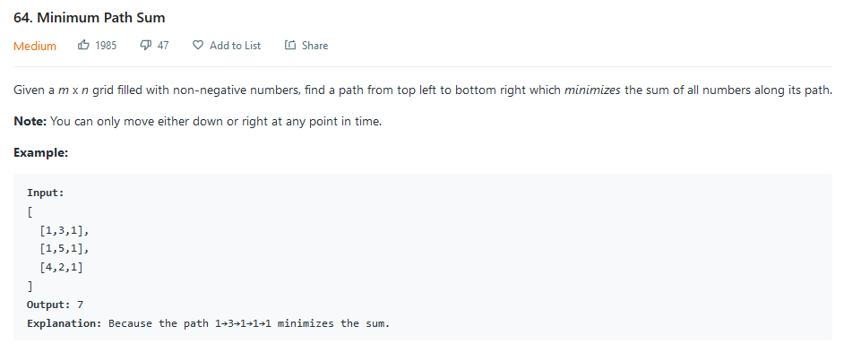
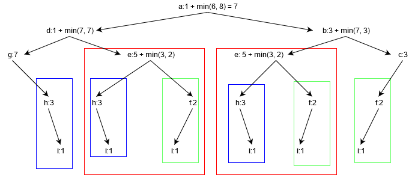
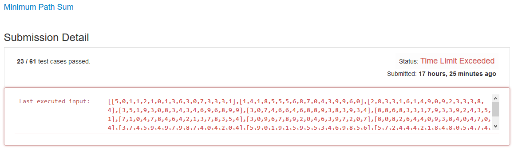
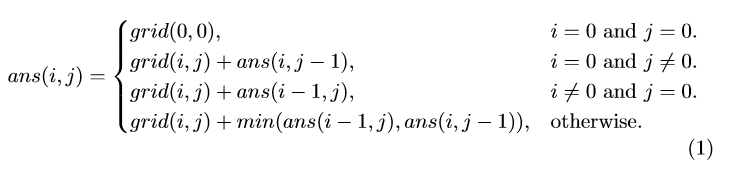
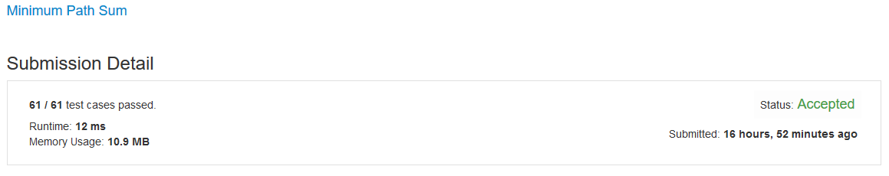

# Minimum Path Sum

## Background

Leetcode (leetcode.com/) is a coding platform that provides interesting programming puzzles for users to solve. I recently came across a question related to optimization in leetcode. I would like to share with you guys how I attempt to handle this question and to improve my solution.

## Description
The description of the question is shown below.



Basically, you will be given a m x n matrix (2-d array) and each element contains an non-negative integer, which can be regarded as the additional cost to reach it. You must start with the top-left element (grid\[0][0]) and finish your journey at the bottom right (grid\[m - 1][n - 1]). The ultimate goal is to find such a path with a **minimized cost**. Noted that you can either go **down or right**.

(Same as the photo shown above, just in case you cannot see it well)

Input: 	vector<vector\<int>>
[
  [1,3,1],
  [1,5,1],
  [4,2,1]
]

Output:  int (The minimized total sum) 

7 since the path 1→3→1→1→1 minimizes the sum.

## Attempt#1 (Time Limit Exceeded)

When I first saw this question, the idea came in my mind is recursion. Recursion normally does not work in questions with Medium tag since recursion takes much more time due to repetitive computation and I therefore quickly switch to dynamic programming approach. Yet, recursion is more intuitive and might help to demonstrate the problem in a clear manner so I also include it here.

### Explanation

Taking the above input as an example, we can label each element with an alphabet from a - i in such manner:
[
 [a,b,c],
 [d,e,f],
 [g,h,i]
]  

We must start from a and end at i, the first step either goes to b or d (only down or right is allowed) and so on. We can thus conclude a diagram with all the possible paths. Since the rightmost path takes least cost, the shortest path is a → b → c → f → i with a cost 7.



However, you can observe that a lot of computations are repeated (refer to red, blue, green boxes) and result in a high execution time.

### Code

>```C++
>class Solution {
>public:
>	int sum(vector<vector<int>>& grid, int row, int col) {
>		// reach the end
>        		// the additional cost is its own value
>		if (row == grid.size() - 1 && col == grid[row].size() - 1) {
>			return grid[row][col];
>		}
>		// at the bottom row
>        		// the total cost is itself + the cost of optimized path using its right element as the starting point
>		if (row >= grid.size() - 1 && col < grid[row].size() - 1) {
>			return grid[row][col] + sum(grid, row, col + 1);
>		}
>		// at the rightmost column
>        		// the total cost is itself + the cost of optimized path using its lower element as the starting point
>		else if (row < grid.size() - 1 && col >= grid[row].size() - 1) {
>			return grid[row][col] + sum(grid, row + 1, col);
>		}
>		else {
>            		// the next step can be right or downward, select the path with a lower cost
>			return grid[row][col] + min(sum(grid, row + 1, col), sum(grid, row, col + 1));
>		}
>	}
>
>	int minPathSum(vector<vector<int>>& grid) {
>		// 0 cost if no elements inside
>		if(grid.size() == 0 || grid[0].size() == 0) return 0;
>
>		return sum(grid, 0, 0);
>	}
>};
>```

 ### Result

Unsurprisingly, the program fails as it undergoes the 24th test case (which is a matrix with a large size) due to time limit exceeded.

The time needed to compute the result is too high.




## Attempt#2 (Accepted)

As I mentioned, it would be more efficient to address the puzzle with dynamic programming approach.

### Explanation

To handle the problem, we can have a new 2-d array to store the optimized result to avoid repetitive work. Back to the previous example

[
  [1,3,1],
  [1,5,1],
  [4,2,1]
]

Let me label them for explanation purpose,

[
 [a,b,c],
 [d,e,f],
 [g,h,i]
]

We can then solve this question with an one-pass loop from a - i,

Considering element a, the minimum cost is 1 since it is the starting point,

Next move on to b, the minimum cost to reach b is 4 since a → b is the only path available,

Similarly, the cost to reach c is 5.

Till now, we obtain an array like this, where N means null or not yet accessed

[
 [1,4,5],
 [N,N,N],
 [N,N,N]
]

Considering element d and g, the only way to reach them is a → d (1 + 2) and a → d → g (1 + 2 + 6).

[
 [1,4,5],
 [2,N,N],
 [6,N,N]
]

It is more complicated for e, f, h, i since the previous step can be from the upper one or the left one. For example, in order to reach e, there are 2 path a → b → e (1 + 4 + 5) or a → d → e (1 + 2 + 5). We know the later path will have a less cost. So we can write 8 into this element.

Similarly, we can conclude this result,

[
 [1,4,5],
 [2,8,6],
 [6,8,7]
]

This implies that to reach the element i, the minimum cost is 7.

**A recurrence relationship is given here**



### Code

> ``` C++
> class Solution {
> public:
> 	int minPathSum(vector<vector<int>>& grid) {
> 		// dynamically allocate of a 2-d int array
> 		int m = grid.size(), n = grid[0].size();
> 		int** ans = new int*[m];
> 		for (int i = 0; i < m; i++) {
> 			ans[i] = new int[n];
> 		}
> 		// compute the least cost to reach each element
>         	// ans[i][j] = the least cost to reach element at i, j
> 		for (int i = 0; i < m; i++) {
> 			for (int j = 0; j < n; j++) {
>                 	// starting point
> 				if (i == 0 && j == 0) {
> 					ans[0][0] = grid[0][0];
> 				}
>                 	// first row
> 				else if (i == 0) {
>                     	// if it is in first row, it can only be accessed by its left elements
>                     	// to reach this element, the cost is its own cost + the cost to reach its left element
> 					ans[i][j] = grid[i][j] + ans[i][j - 1];
> 				}
>                 	// first column
> 				else if (j == 0) {
> 					ans[i][j] = grid[i][j] + ans[i - 1][j];
> 				}
> 				else {
>                     	// it can be accessed either by upper element or left element, so select the minimized one
> 					ans[i][j] = grid[i][j] + min(ans[i - 1][j], ans[i][j - 1]);
> 				}
> 			}
> 		}
> 		// ans donates the least cost to reach the bottom right element
> 		return ans[m - 1][n - 1];
> 	}
> };
> ```

### Result



## Possible Extensions

I think there may be some further improvements available:

* write a backtracking function so that the program can tell the full path instead of just the total cost
  * For example, (2,2) ← (1,2) ← (0,2) ← (0,1) ← (0,0)
* what if the next step can go diagonal ↘ in addition to right and down (that means a can go to e directly)
  * It requires modification in recurrence relationship
* translation into other programming languages i.e. Java, Python, JavaScript
* maybe you can model it as a directed graph and compute the answer with Dijkstra Algorithm